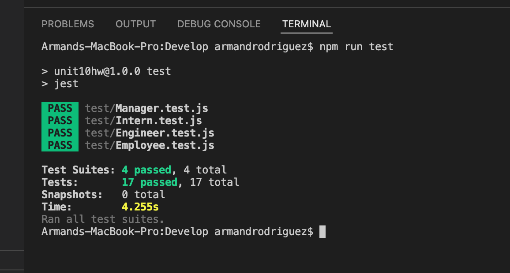

# team-profile-generator

## Description

This application is a team profile generator. With the use of node.js and code terminal, the user is given prompts that they must give answers to in order to generate a produce an html file that displays a teams basic information.

##  Future Development

In future development of this application I would like to finish the functioonality of the overall application. This application is still in its beginning stages and has to be developed more.

##  Usage 

The application will need to be accessed through the use of node.js to generate your HTML.

## Contributors

Starter code was provided by class instructor Kevin Ferguson.

## Installation

You must download the application code from the repository and clone it to your local machine.
After the code has been cloned to your machine, you can then type 'npm install' in the "Develop" directory 
of that repository to have access to the dependencies for this application to work.

## Links

[Link to Application Repository](https://github.com/ArmondR/team-profile-generator)

## Screenshot

### License

______

MIT License

Copyright (c) [2022] [Armond Rodriguez]

Permission is hereby granted, free of charge, to any person obtaining a copy
of this software and associated documentation files (the "Software"), to deal
in the Software without restriction, including without limitation the rights
to use, copy, modify, merge, publish, distribute, sublicense, and/or sell
copies of the Software, and to permit persons to whom the Software is
furnished to do so, subject to the following conditions:

The above copyright notice and this permission notice shall be included in all
copies or substantial portions of the Software.

THE SOFTWARE IS PROVIDED "AS IS", WITHOUT WARRANTY OF ANY KIND, EXPRESS OR
IMPLIED, INCLUDING BUT NOT LIMITED TO THE WARRANTIES OF MERCHANTABILITY,
FITNESS FOR A PARTICULAR PURPOSE AND NONINFRINGEMENT. IN NO EVENT SHALL THE
AUTHORS OR COPYRIGHT HOLDERS BE LIABLE FOR ANY CLAIM, DAMAGES OR OTHER
LIABILITY, WHETHER IN AN ACTION OF CONTRACT, TORT OR OTHERWISE, ARISING FROM,
OUT OF OR IN CONNECTION WITH THE SOFTWARE OR THE USE OR OTHER DEALINGS IN THE
SOFTWARE.

### Badges

____

    